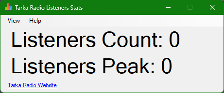

# Tarka Radio Listeners Stats

This program will count how many listeners they are when they are listening to Tarka Radio.

Once you started the program, it will update the listeners straight away and updates it every 10 seconds.

Radio Website: <a href="https://tarkaradio.co.uk">tarkaradio.co.uk</a>

## Requirements

- Internet Connection (needed for updates and the program itself)
- <a href="https://dotnet.microsoft.com/en-us/download/dotnet-framework/net462">.NET Framework 4.6.2</a>